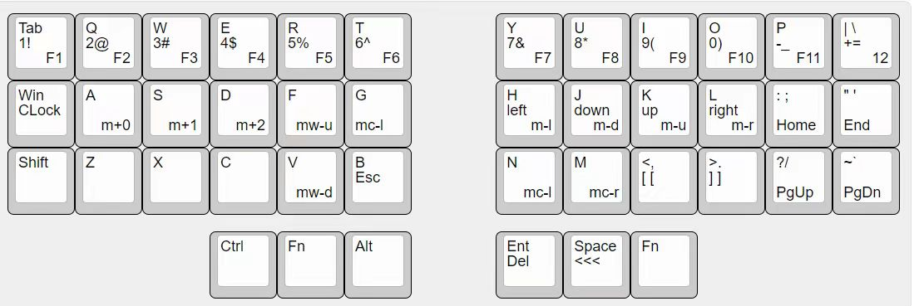
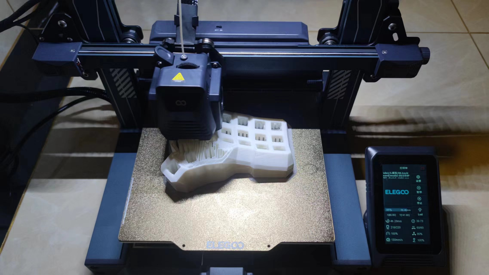

# my-split-keyboard 

注：本人一点单片机基础都没有，只是网上各种找资料，一步步拼凑出来的，连焊锡都是现学的。 

### 成品展示

- 键盘布局有三层：
  - 第一层，默认常规的字母键，为图中键位左上角的标注
  - 第二层，长按左手fn键，主要切换为数字键，及方向键，为图中键位中间的标注
  - 第三层，长按右手fn键，主要切换为F1-F12功能键，及鼠标模式(带m开头的标注)，为图中键位右下角的标注

### 准备
- 硬件：
  - 3D打印机一台、及打印耗材
  - 焊烙铁一台、及焊锡丝
  - 主控：Pro Micro Atmege32u4 两个
  - USBISP 下载器一个 
    - 用来给主控烧录引导程序
  - 二极管，直接买100根备用
  - 杜邦线，焊接前测试用
  - PJ313 直插5脚（3节）的耳机插座，至少两个（多买点备用）
  - 3段式的耳机线
    - 多买两根没几块钱
  - 防滑贴
    - 打印的键盘模具放桌子上会比较滑
  - 螺丝+螺帽，M2.0 到 M3.5，
    - 各型号多买几个，不同模型打印出来需要的型号还不一样（我把全型号都买了才买到合适的）
  - 镊子，至少一个吧
  - 手，至少一双吧

- 软件：
  - QMK MSYS: 用来编译固件代码，可以找个合适的布局手动修改适合自己的键位，再编译
  - avrdudess: 使用 USBISP下载器 ，给 Atmege32u4 刷引导程序
  - QMK Toolbox: 用来给 Atmege32u4 把编译好的固件代码烧录进去
  - VIA: 如果烧录的固件代码支持via改键的可以用，我没用

- 网站
  - [https://kbfirmware.com/](https://kbfirmware.com/) 
    - 常规的一体键盘可以用它来生成固件代码，分体不行
  - [http://www.keyboard-layout-editor.com/#/](http://www.keyboard-layout-editor.com/#/) 
    - 搭配kbfirmware用，生成布局的json，可以用来画个草图
  - [https://docs.qmk.fm/#/keycodes?id=keycodes-overview](https://docs.qmk.fm/#/keycodes?id=keycodes-overview) 
    - QMK 文档
  - [https://www.printables.com/model](https://www.printables.com/model) 
    - 3D模型图纸下载
  - [https://www.thingiverse.com/](https://www.thingiverse.com/) 
    - 3D模型图纸下载
  - [https://github.com/gsihaj5/qmk_firmware](https://github.com/gsihaj5/qmk_firmware) 
    - QMK 源码
  - [https://github.com/sparkfun/SF32u4_boards](https://github.com/sparkfun/SF32u4_boards) 
    - 32U4的引导程序固件
  - [https://www.printables.com/model/540985-corne-keyboard-high-profile-case-with-integrated-p](https://www.printables.com/model/540985-corne-keyboard-high-profile-case-with-integrated-p) 
    - 我自己用的模型，另一个模型名字叫dactyl，找不到图纸了，去搜关键字
  - [https://www.printables.com/model/34277-custumizable-solderless-wire-termination-with-pin-](https://www.printables.com/model/34277-custumizable-solderless-wire-termination-with-pin-) 
    - 可以用来固定主控，打印高度50%，然后主控的引脚剪断一半，就刚刚好了，再配合点502胶水什么的
  - [https://www.printables.com/model/432013-dactyl-cc-v2-promicro-holder](https://www.printables.com/model/432013-dactyl-cc-v2-promicro-holder)
    - 也是用来固定主控的，但是用在dactyl的模型上
  - [https://monkeytype.com/](https://monkeytype.com/)
    - 打字用的，拿来熟悉键盘

### 开工
#### 编译固件源码

- 安装QMK MSYS， qmk源码有很多固件源码，我是拿了splitkb/aurora/corne来改的

[keymaps](./splitkb/aurora/corne/keymaps/custom_01/keymap.json)

- QMK MSYS执行命令生成固件： qmk compile -kb splitkb/aurora/corne -km custom_01
- 全【ok】就没问题啦

- 得到固件文件： splitkb_aurora_corne_rev1_custom_01.hex

#### 烧录引导程序
- 接线

- 接入pc，打开软件avrdudess, 把引导程序【Caterina-promicro16.hex】烧录进去
> 直接看着我的配置吧

- 换数据线，接上主控32u4，把固件【splitkb_aurora_corne_rev1_custom_01.hex】烧录进去

#### 测试、接线

